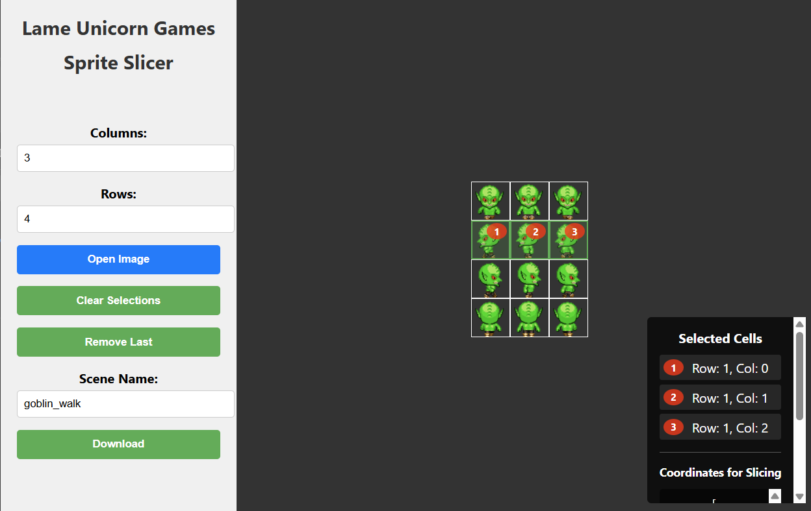

# Lame Unicorn Games - Sprite Sheet Slicer
A React TypeScript application for slicing sprite sheets into individual images.

<div align="center" style="margin-top: 10px;">
  
</div>

## Installation

To get started with Sprite Sheet Slicer, follow these steps:

1. Clone the repository
2. Navigate to the project directory
3. Install dependencies:

```bash
npm install
```

## Running the Application

To run the application in development mode:

```bash
npm start
```

This will start the development server and open the application in your default browser at [http://localhost:3000](http://localhost:3000).

## Building for Production

To create a production build:

```bash
npm run build
```

This will create optimized files in the `build` folder that you can deploy to a web server.

## How to Use the HTML Slicer

### Basic Workflow

1. **Load a Sprite Sheet**:
   - The application loads with a default sprite sheet
   - To use your own sprite sheet, click the blue "Open Image" button and select an image file

2. **Set Up the Grid**:
   - Enter the number of columns and rows to divide your sprite sheet
   - The grid will appear over your image

3. **Select Cells**:
   - Click on cells in the order you want to extract them
   - Each selected cell will be numbered according to the selection order
   - You can deselect a cell by clicking on it again (this will also remove all cells selected after it)

4. **Manage Selections**:
   - Use the "Clear Selections" button to remove all selections
   - Use the "Remove Last" button to remove the most recently selected cell

5. **Download Selected Cells**:
   - Once you've selected cells, a "Scene Name" textbox and "Download" button will appear
   - Enter a name for your scene (this will be used in the filenames)
   - Click "Download" to get a zip file containing all selected cells as individual PNG images

### Tips

- Images are processed entirely in the browser - no files are uploaded to any server
- Selected cells are named according to the pattern: `{scene_name}_{order_number}.png`
- You can change the grid dimensions at any time, but this will clear your current selections
- For best results, use sprite sheets with evenly sized sprites

## Technologies Used

- React
- TypeScript
- HTML Canvas for image processing
- JSZip for creating zip files

## Goblin Sprite Sheet Example 
- Thank you: https://galacticgod.itch.io/rpg-maker-npc-character-set-goblin
